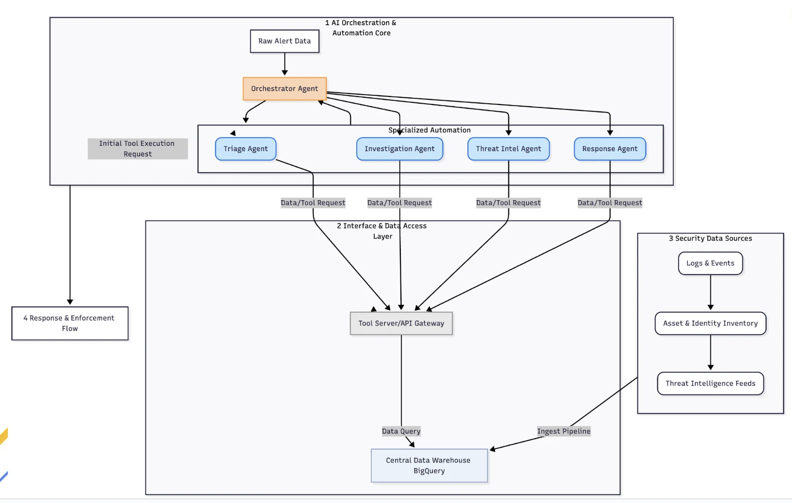

# 🛡️ Cyber Guardian Agent Recipe

## A. Overview & Functionalities

### 📋 Recipe Details

| Attribute | Description |
| :--- | :--- |
| **Interaction Type** | ⚙️ **Workflow** (Structured step-by-step execution with conditional routing) |
| **Complexity** | 🧠 **Advanced** (Multi-agent orchestration, conditional logic, tool piping) |
| **Agent Type** | 👥 **Multi-Agent System** (Hierarchical Orchestrator with 4 Specialized Sub-agents) |
| **Vertical** | 🔒 **Cybersecurity / Security Operations (SecOps)** |

---

### ✨ Key Features

The Cyber Guardian Agent is an AI-driven recipe that leverages a **hierarchical multi-agent architecture** built on Google's Agent Development Kit (ADK) to automate incident triage, investigation, and response.

#### 🧠 1. Orchestration & Routing
*   **Orchestrator Agent**: Acts as the central coordinator. It parses raw alert data (e.g., EDR detections, Phishing emails, IOC matches) and manages execution flow.
*   **Dynamic Paths**: Intelligently reroutes the investigation path based on gathered evidence. For example, it runs **Threat Intel** *before* **Investigation** for IOC alerts, but *after* **Investigation** for process-heavy EDR alerts to verify newly discovered indicators.

#### 🛠️ 2. Specialized Python Tools
*   **Native Python Integration**: Forensic and investigative tools are implemented as Python functions, integrated via ADK's `FunctionTool` for low latency and seamless data passing.
*   **BigQuery Integration**: Tools query BigQuery tables for logs, asset inventory, and threat intelligence, effectively serving as a high-speed context and retrieval source for security events.

#### 👥 3. Specialized Sub-Agents
*   **Triage Agent**: Assesses alert severity, deduplication, and context enrichment via SIEM logs.
*   **Investigation Agent**: Digs deep into process and network logs to confirm blast radius and derive new Indicators of Compromise (IOCs).
*   **Threat Intel Agent**: Performs lookups on file hashes, IPs, and domains against threat intelligence knowledge bases.
*   **Response Agent**: Maps findings to predefined playbooks and recommends surgical mitigation actions.

---

## B. Architecture Visuals



---

## C. Setup & Installation

Follow these steps to set up the environment, authenticate, and configure the recipe.

### 1. Navigate to Recipe Directory
Clone the repository and switch to the recipe directory:
```bash
git clone https://github.com/google/adk-recipes.git
cd adk-recipes/contrib/python/cyber-guardian-agent
```

### 2. Google Cloud Authentication
The recipe requires access to BigQuery and Vertex AI. Authenticate your local environment:
```bash
gcloud auth application-default login
```

### 3. Install Dependencies with uv
This repository uses `uv` for fast, deterministic dependency management:
```bash
uv sync
```

### 4. Configure Environment Variables
Copy the `.env.example` file to create your local `.env`:
```bash
cp .env.example .env
```

Configure your project settings in `.env`:
```env
GOOGLE_GENAI_USE_VERTEXAI=TRUE
GOOGLE_CLOUD_PROJECT=your-gcp-project-id
GOOGLE_CLOUD_LOCATION=global
BQ_DATASET=cyber_guardian_dataset
MODEL_NAME=gemini-3.7-flash
```

> [!IMPORTANT]
> Ensure `GOOGLE_CLOUD_PROJECT` matches your GCP project ID where BigQuery and Vertex AI are enabled.

---

## D. Running the Agent

You can interact with the Cyber Guardian Agent through a web interface or directly via the command line.

### Option 1: Web UI (Recommended)
Launch the ADK web interface:
```bash
uv run adk web --port 8081
```
Open `http://localhost:8081` in your browser and select the `cyber_guardian_orchestrator` agent.

### Option 2: CLI Direct Execution
Run the agent directly from the terminal for quick testing:
```bash
uv run adk run app:root_agent --input "Raw alert text here..."
```

**Example Test Query:**
```bash
uv run adk run app:root_agent --input "IOC_Match: hostname: kvm01, user: admin, ip_address: 192.168.1.50, IOC: high_risk_hash_123"
```

---

## E. Testing with Sample Inputs

Sample inputs are available in `sample_input.txt` for evaluation:
*   **Sample Input 1**: EDR Detection (Malicious PowerShell execution)
*   **Sample Input 2**: IOC Match (Malicious IP address communication)
*   **Sample Input 3**: Phishing Email (Suspicious inbound domain)

Copy the raw alert text from `sample_input.txt` into the chat input of the ADK web UI to observe how the orchestrator routes tasks across sub-agents and tools to resolve the incident.
